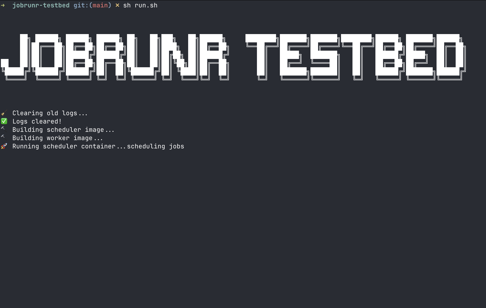
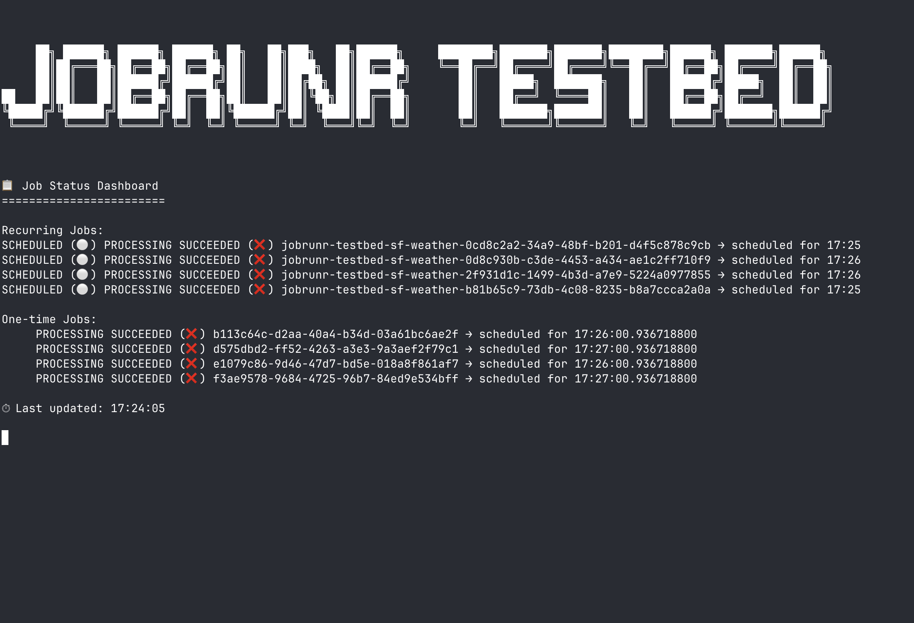

# 🧪 JobRunr Testbed

A controlled test environment to validate JobRunr's job scheduling, processing, fault tolerance, and recovery across multiple containers.

This testbed does the following:
- Builds and launches a scheduler that schedules 60 recurring and 60 one-time jobs.
- Waits for the scheduler to exit.
- Spins up 5 worker containers to process jobs.
- Optionally simulates worker failure/recovery.
- Verifies which jobs were picked up and completed by parsing logs.


## 🗂 Directory Structure
```
jobrunr-testbed/
├── docker/
│ ├── scheduler/ # Scheduler app that schedules jobs
│ │ └── docker-compose.yml
│ ├── worker/ # Worker app that processes jobs
│ │ └── docker-compose.yml
│
├── logs/ # Logs for job scheduling and worker output
│ ├── scheduled-job-ids.txt
│ ├── worker-logs.txt
│ └── ...
│
├── orchestrator/
│ ├── kill_and_spawn.py # Optional script to kill/spawn containers randomly
│ ├── verify_jobs.py # Script to verify job execution
│
├── startup.sh # Entry point script that builds and runs the test
└── README.md
```


# 🚀 Usage

### 1. Build and Run

```bash
chmod +x run.sh
./run.sh
```
This will:

- Build scheduler and worker Docker images
- Run the scheduler container (which exits after scheduling jobs)
- Launch 5 worker containers to process the jobs


# 📝 Log Output
- Scheduled Job IDs: `logs/scheduled-job-ids.txt`
- Worker Logs: `logs/worker-logs.txt`


## 📸 Screenshots

### 🔧 Scheduler Scheduling Jobs



---

### 📊 Verification Report Summary

